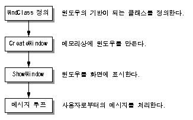

기본적인 WinAPI의 구조 및 과정
======================================

 C++을 사용한 자체 엔진 개발을 위해 기본적으로 VS의 **Windows 데스크톱 마법사**를 사용하여 시작을 할 것이다.
 위부터 차례로 함수 하나씩 짚어갈 것이다. 

# 1. wWinMain 함수
wWinMain 함수를 부분적으로 알아보겠다. 해당 부분은 프로젝트의 wWinMain 부분을 띄워두고 흐름을 확인하길 바란다.
 ## Parameter (매개변수)
``` cpp
int APIENTRY wWinMain(_In_ HINSTANCE hInstance,
                     _In_opt_ HINSTANCE hPrevInstance,
                     _In_ LPWSTR    lpCmdLine,
                     _In_ int       nCmdShow)
```
wWinMain 함수의 파라미터는 4가지가 존재한다.

HINSTANCE hInstance는 프로그램의 인스턴스 핸들이다. 
  ### 핸들이란?
>   특정 리소스나 메모리와 같이 직접적으로 접근할 수 없는 곳에 간접적으로 접근할 수 있도록 시스템이나 라이브러리가 제공하는 추상화된 참조이다. 포인터와 비슷하나 핸들은 실제 메모리 주소를 직접적으로 노출하지 않는다. 각 리소스의 고유 식별자 역할로도 쓰인다.
   
HINSTANCE hPrevInstance는 직전에 실행된 프로그램의 인스턴스 핸들이다. (현재는 잘 사용하지 않는다함. 현재는 NULL 전달.)
 
LPWSTR lpCmdLine은 명령행 인자로 프로그램 시작시 전달되는 정보이다. 

int nCmdShow는 윈도우가 표시되는 방법을 제어한다.

파라미터는 위 4가지로 구성되어있다. 해당 프로그램의 핸들, 직전 프로그램의 핸들, 프로그램 시작시 전달할 정보, 윈도우 표시 방법을 전달 받는다.

## 문자열 초기화
``` cpp
 LoadStringW(hInstance, IDS_APP_TITLE, szTitle, MAX_LOADSTRING);
 LoadStringW(hInstance, IDC_EDITORWINDOW, szWindowClass, MAX_LOADSTRING);
```
앱의 타이틀과 에디터 창의 이름을 초기화 하는 곳이다. 

## MyRegisterClass -창 클래스 초기화 및 등록
``` cpp
ATOM MyRegisterClass(HINSTANCE hInstance)
{
    WNDCLASSEXW wcex;

    wcex.cbSize = sizeof(WNDCLASSEX);

    wcex.style          = CS_HREDRAW | CS_VREDRAW;
    wcex.lpfnWndProc    = WndProc;
    wcex.cbClsExtra     = 0;
    wcex.cbWndExtra     = 0;
    wcex.hInstance      = hInstance;
    wcex.hIcon          = LoadIcon(hInstance, MAKEINTRESOURCE(IDI_EDITORWINDOW));
    wcex.hCursor        = LoadCursor(nullptr, IDC_ARROW);
    wcex.hbrBackground  = (HBRUSH)(COLOR_WINDOW+1);
    wcex.lpszMenuName   = MAKEINTRESOURCEW(IDC_EDITORWINDOW);
    wcex.lpszClassName  = szWindowClass;
    wcex.hIconSm        = LoadIcon(wcex.hInstance, MAKEINTRESOURCE(IDI_SMALL));

    return RegisterClassExW(&wcex);
}
```
 빌드 시 뜨게되는 창의 기본 설정을 하는 곳이다.
 이 곳에서 해당 창에서 출력될 커서와 아이콘 등을 설정할 수 있다.

### WndProc
``` cpp
 LRESULT CALLBACK WndProc(HWND hWnd, UINT message, WPARAM wParam, LPARAM lParam)
{
    switch (message)
    {
    case WM_COMMAND:
        {
            int wmId = LOWORD(wParam);
            // 메뉴 선택을 구문 분석합니다:
            switch (wmId)
            {
            case IDM_ABOUT:
                DialogBox(hInst, MAKEINTRESOURCE(IDD_ABOUTBOX), hWnd, About);
                break;
            case IDM_EXIT:
                DestroyWindow(hWnd);
                break;
            default:
                return DefWindowProc(hWnd, message, wParam, lParam);
            }
        }
        break;
    case WM_PAINT:
        {
            PAINTSTRUCT ps;
            HDC hdc = BeginPaint(hWnd, &ps);
            // TODO: 여기에 hdc를 사용하는 그리기 코드를 추가합니다...
            EndPaint(hWnd, &ps);
        }
        break;
    case WM_DESTROY:
        PostQuitMessage(0);
        break;
    default:
        return DefWindowProc(hWnd, message, wParam, lParam);
    }
    return 0;
}
```
wWinMain 함수에서는 윈도우를 생성, 출력만 하며 실질적인 동작은 WndProc에서 이루어진다. WndProc은 메시지를 통해 동작을 수행하게 된다. 그렇지만 이곳에서 모든 동작을 작성하게 되면 코드가 지저분해지고 관리가 어렵게되기에 이 곳에서 다 작성하지는 않는다.

## InitInstance
``` cpp
//
//   함수: InitInstance(HINSTANCE, int)
//
//   용도: 인스턴스 핸들을 저장하고 주 창을 만듭니다.
//
//   주석:
//
//        이 함수를 통해 인스턴스 핸들을 전역 변수에 저장하고
//        주 프로그램 창을 만든 다음 표시합니다.
//
BOOL InitInstance(HINSTANCE hInstance, int nCmdShow)
{
   hInst = hInstance; // 인스턴스 핸들을 전역 변수에 저장합니다.

   HWND hWnd = CreateWindowW(szWindowClass, szTitle, WS_OVERLAPPEDWINDOW,
       CW_USEDEFAULT, 0, 1600, 900, nullptr, nullptr, hInstance, nullptr);

   if (!hWnd)
   {
      return FALSE;
   }

   ShowWindow(hWnd, nCmdShow);
   UpdateWindow(hWnd);

   return TRUE;
}
```
창을 생성하고 해당 창의 핸들을 전역변수로 저장을 하는 함수이다. CreateWindowW()를 통해 창의 이름, 사이즈, 종류 등을 설정하고 생성하게 된다.

ShowWindow - 창을 보여주는 함수(해당 함수를 지우고 빌드 시, 창이 뜨지 않음)
UpdateWindow - 보여진 창의 업데이트 사항이 있을시 업데이트를 해주는 함수

**각각의 매크로 상수는 따로 정리하지 않았다.**

## 이후 While 메시지 루프
``` cpp
    // 기본 메시지 루프입니다:
    while (GetMessage(&msg, nullptr, 0, 0))
    {
        if (!TranslateAccelerator(msg.hwnd, hAccelTable, &msg))
        {
            TranslateMessage(&msg);
            DispatchMessage(&msg);
        }
    }
```
InitInstance 이후 While에서 메시지 루프를 돌게 될 것이다. 메시지를 받고 처리하는 과정이 사라지게 되면 해당 프로젝트는 창이 생성 직후 바로 닫히게 될 것이다. 

# 윈도우 생성 과정
여기까지가 윈도우(창)을 만들고 실행되는 과정에 있는 내용을 정리한 것이다.

간단하게 정리를 하면 다음 그림과 같다. 


